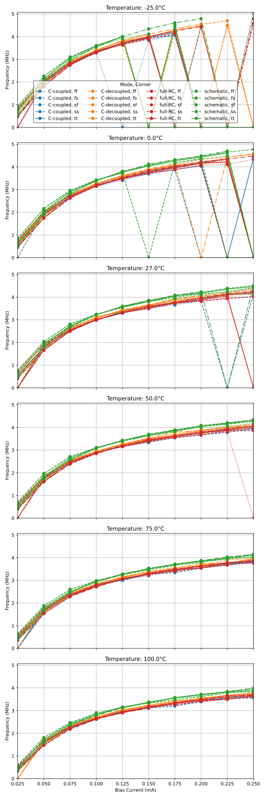

 

# Analog Voltage Controlled Oscillator

* [Summary](./docs/info.md)
* [Designer information](./DEVINFO.md)

## CACE Characterization

See [Designer information: CACE](./DEVINFO.md#cace) for further information.

* [Summary](docs/vco.md)
* [Schematic](docs/vco_schematic.md)
* [Layout](docs/vco_layout.md)

## Custom Characterization

See [Designer information: Custom Verification](./DEVINFO.md#custom-verification) for further information.

* [vco_characterization.csv](./xschem-pex/vco_characterization.csv) contains all simulation results in csv format. The results are also plotted below.

## Tiny Tapeout

This is a [Tiny Tapeout](https://tinytapeout.com) project based on a clone of the [Tiny Tapeout Analog Project Template](https://github.com/TinyTapeout/tt08-analog-template) and is submitted for manufacturing to [Tiny Tapeout 08](https://tinytapeout.com/runs/tt08/).
