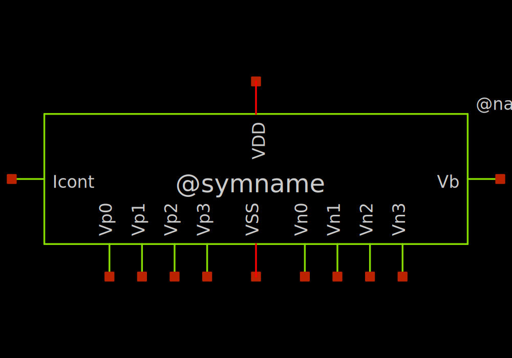
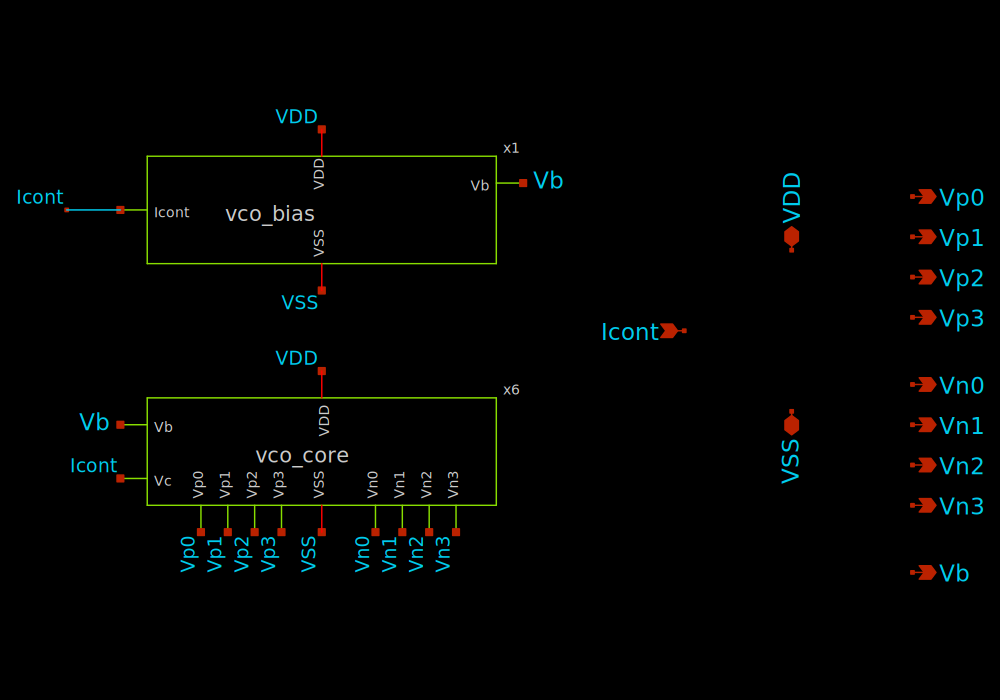
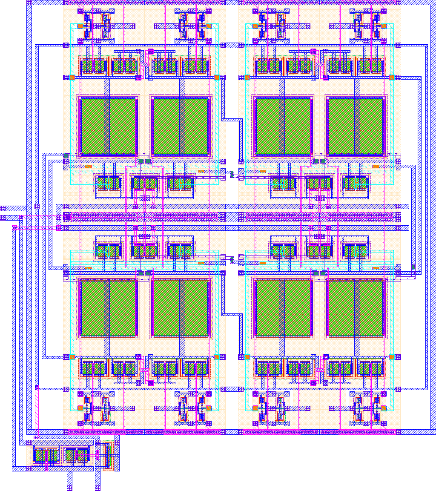
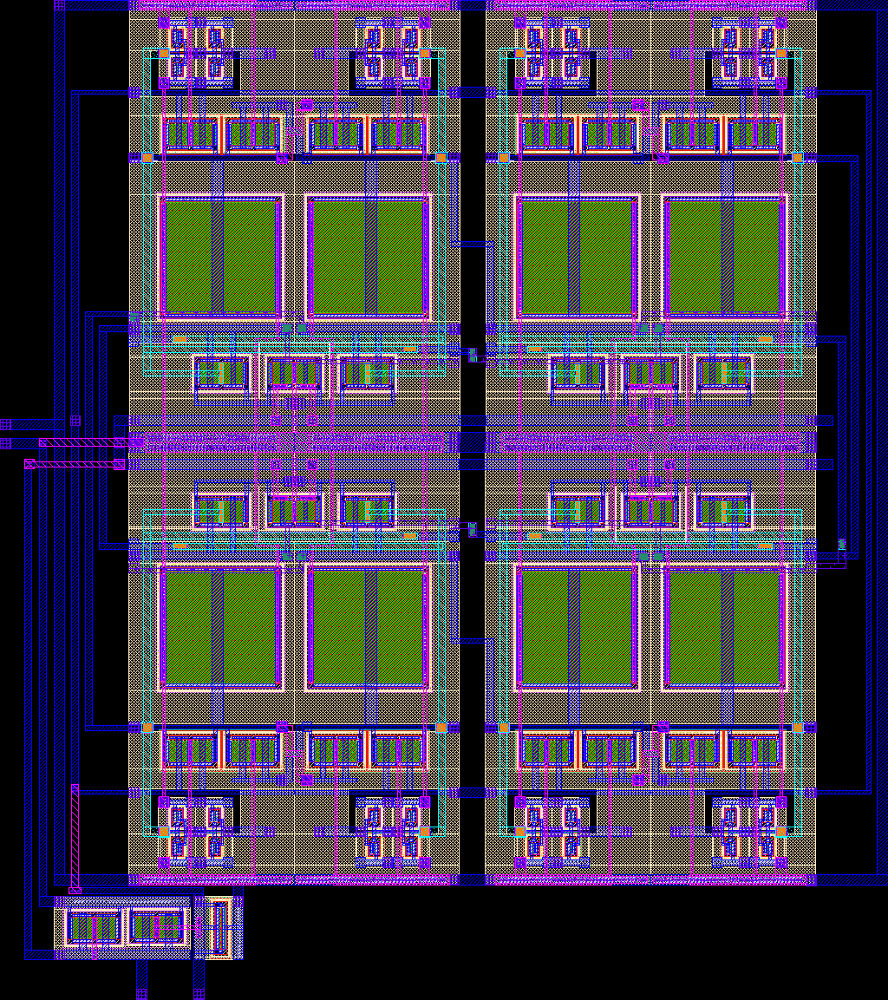

# vco

- Description: An analog voltage controlled oscillator
- PDK: sky130A

## Authorship

- Designer: Georg Boecherer
- Company: None
- Created: August 2024
- License: Apache 2.0
- Last modified: None

## Pins

- VDD
  + Description: Positive analog power supply
  + Type: power
  + Direction: inout
  + Vmin: 1.7
  + Vmax: 1.9
- VSS
  + Description: Analog ground
  + Type: ground
  + Direction: inout
- Icont
  + Description: Bias current input
  + Type: signal
  + Direction: input
- Vp0
  + Description: Stage 0 positive voltage digital output output
  + Type: signal
  + Direction: output
- Vp1
  + Description: Stage 1 positive voltage digital output output
  + Type: signal
  + Direction: output
- Vp2
  + Description: Stage 2 positive voltage digital output output
  + Type: signal
  + Direction: output
- Vp3
  + Description: Stage 3 positive voltage digital output output
  + Type: signal
  + Direction: output
- Vn0
  + Description: Stage 0 negative voltage digital output output
  + Type: signal
  + Direction: output
- Vn1
  + Description: Stage 1 negative voltage digital output output
  + Type: signal
  + Direction: output
- Vn2
  + Description: Stage 2 negative voltage digital output output
  + Type: signal
  + Direction: output
- Vn3
  + Description: Stage 3 negative voltage digital output output
  + Type: signal
  + Direction: output
- Vb
  + Description: pmos bias voltage
  + Type: signal
  + Direction: output

## Default Conditions

- vdd
  + Description: Analog power supply voltage
  + Display: Vdd
  + Unit: V
  + Typical: 1.8
- icont
  + Description: Bias current
  + Display: Icont
  + Unit: mA
  + Typical: 0.1
- corner
  + Description: Process corner
  + Display: Corner
  + Typical: tt
- temperature
  + Description: Ambient temperature
  + Display: Temp
  + Unit: °C
  + Typical: 27

## Symbol

## Schematic

## Layout

